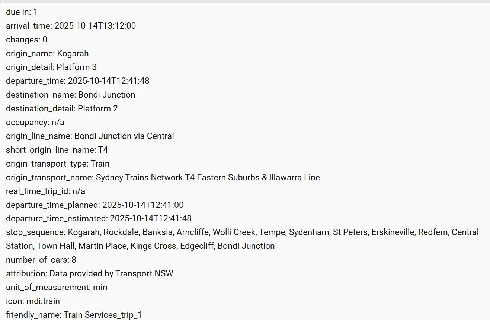

# Transport NSW (AU) – Raw Trip Sensor (Custom Fork)

> _Vibe-coded by **ChatGPT**; **tested & reviewed by Fabricio Monteiro Pontes**._

This custom sensor integrates with Transport for NSW Trip Planner and exposes the **next departures** between an origin and destination.  
It uses a **single raw Trip Planner call** and parses the JSON locally to provide robust attributes suitable for Home Assistant UIs (PIDS-style boards, dashboards, etc.).

## Key features
- **Single-call raw JSON** path for speed and reliability.
- Three detail levels via `return_info`: `brief`, `medium`, `verbose`.
- Clean **local time** strings and a friendly **“due in” minutes** state.
- Smarter **stop names** (e.g., “Kogarah”, preserves “Central Station”) and **platform** extraction (“Platform 2”).
- **Verbose-only** extras:
  - `departure_time_planned`, `departure_time_estimated`
  - `stop_sequence` (list of short stop names for the first leg)
  - `number_of_cars` (best-effort extraction from multiple fields)

## New output:



## Configuration (Home Assistant)
```yaml
sensor:
  - platform: transportnsw
    origin_id: "Kogarah Station"
    destination_id: "Central Station"
    api_key: !secret tnsw_api_key
    name: "Kogarah_to_Central"
    trip_wait_time: 0
    transport_type: 0                 # kept for back-compat
    strict_transport_type: false      # kept for back-compat
    return_info: verbose              # brief | medium | verbose
    trips_to_create: 3                # 1..6 sensors
    route_filter: ""                  # optional string
    include_realtime_location: false  # kept for back-compat (ignored by raw)
    include_alerts: none              # none|verylow|low|normal|high|veryhigh
    alert_types:                      # kept for back-compat
      - lineInfo
      - stopInfo
      - routeInfo
      - stopBlocking
      - bannerInfo

